# Понимаем красно-черное дерево. Часть 1. [Введение](https://habr.com/ru/post/555404/)

Довольно долгое время я воевал с красно-черным деревом (далее - кчд). Вся информация, которую я находил, была в духе "листья и корень дерева всегда черные, ПОТОМУ ЧТО", "топ 5 свойств красно-черного дерева" или "3 случая при балансировке и 12 случаев при удалении ноды". Такой расклад меня не устраивал.

Мне не хотелось заучивать свойства дерева, псевдокод и варианты балансировки, я хотел знать: почему. Каким образом цвета помогают при балансировке? Почему у красной ноды не может быть красного потомка? Почему глубину дерева измеряют "черной высотой"?

Ответы на эти вопросы я получил только тогда, когда мне дали ссылку на лекцию про два-три дерево, с которого мы и начнем.

Эта статья разделена на 3 логические части. Я рекомендую прочитать их в указанном порядке. Первая часть (данная) будет направлена на введение в кчд и знакомство с ним. Во второй части мы поговорим о балансировке и вставке в кчд. В третьей, завершающей, части мы разберем процесс удаления ноды. Наберитесь терпения и приятного чтения:)

_Дисклеймер_

В этой статье не будет информации про плюсы и минусы дерева, его применение и т.д.: информации об асимптотике дерева и работе с ним в интернете полно.

Материал предназначен для тех, кто уже знаком с кчд и теперь хочет их понять, а также для тех, кто только знакомится с ними.

Статья не будет содержать деталей реализации структуры.

Можно считать что эта статья — перевод английского видео материала в упрощенный русский текстовый вариант. Все ссылки я оставляю в конце статьи.

## Два-три дерево

> Чтобы понять красно-черное дерево, нужно понять два-три дерево

Забегая вперед, скажу, что два-три дерево - это, по сути, родитель нашего кчд, поэтому важно начать именно с него. Поймем два-три дерево - поймем и кчд.

__Два-три дерево__ - [абстрактный тип данных](https://ru.wikipedia.org/wiki/%D0%90%D0%B1%D1%81%D1%82%D1%80%D0%B0%D0%BA%D1%82%D0%BD%D1%8B%D0%B9_%D1%82%D0%B8%D0%BF_%D0%B4%D0%B0%D0%BD%D0%BD%D1%8B%D1%85), напоминающий по структуре дерево. `В нодах два-три дерева может быть одно или два значения и два или три потомка` (от чего зависит количество значений и потомков ноды, узнаем ниже). Ноду с одним значением и двумя потомками будем называть `2-нода`, ноду с двумя значениями и тремя потомками - `3-нода`. Объяснение я начну с создания такого дерева: это наглядно и просто. Но некоторые уточнения нужны все же вначале:

1. Добавляя элемент, мы всегда спускаемся вниз по дереву.

2. Дерево отсортировано классически - меньшие значения находятся слева, бОльшие - справа.

3. Два-три дерево - отсортированное, сбалансированное дерево.

Итак, начнем с первой ноды, это число 5. Тут все просто - 5 становится корнем.

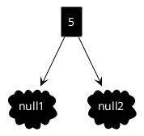

Добавим число 12. Число 12 мы так же добавляем в корень (помним, что нода может иметь два значения), но теперь нам нужно "отсортировать" нашу ноду (сортировать два элемента, ха), т.е. уложить их в порядке возрастания. В итоге получается нода 5-12.

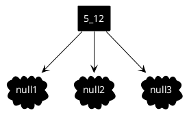

Добавим следующее число. Пусть это будет 17. Давайте пока добавим наш элемент в единственную ноду и снова отсортируем ее. Получилась нода 5-12-17.

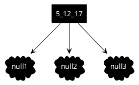

Внимательный читатель заметит тут подвох - выше я говорил о том, что наши ноды могут содержать не более двух элементов. Вот тут и происходит магия! Мы берем средний элемент нашей ноды и "просачиваем" его наверх. Итог виден на картинке. Корнем стало число 12, левым сыном число 5, правым - 17.

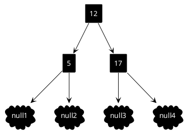

То, что мы сделали выше, можно назвать `балансировкой два-три дерева`. Правило в этой балансировке простое: `если в ноде оказывается три значения, среднее значение мы "просачиваем" вверх`. Алгоритм действий зависит от 3 условий:

1. Нода является корнем. Тогда ничего не остается, как создать новую ноду с одним значением и сделать ее новым корнем (как в нашем случае).

2. Родительская нода имеет одно значение. Тогда мы просто добавляем значение к родителю и завершаем балансировку (при этом у родителя появляется третий потомок).

3. Родительская нода имеет два значения. Тогда мы снова просачиваем значение вверх, пока не придем к пункту один или два.

Второй и третий случай балансировки будут рассмотрены ниже.

Окей, идем дальше. Давайте добавим число 3. Так как теперь мы не ограничиваемся одной нодой, спускаемся вниз. Понятно, что спуститься надо влево и добавить 3 к ноде со значением 5. Не забываем расставить 3 и 5 в нужном порядке. В итоге получилась нода 3-5.

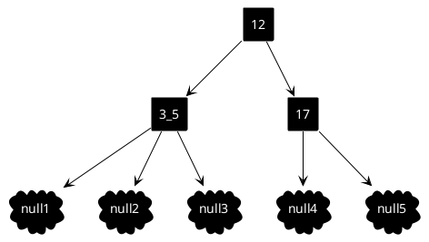

Потерпите, мы близимся к самому интересному:)

Давайте добавим число 4 которое также пойдет влево и присоединится к ноде 3-5. Получится нода 3-4-5, которую, как мы уже знаем, нужно привести к нужному виду. 

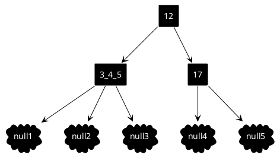

Что делаем? Балансируем наше дерево, т.е. "просачиваем" значение 4 наверх.

Теперь самое интересное. Помимо того, что мы добавим 4 к корню, мы так же добавим корню третьего потомка - это будет нода, которая была больше 4. В нашем случае это 5. Картина будет выглядеть так:

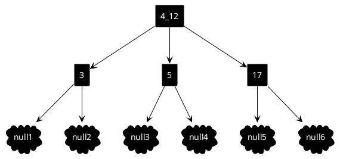

Почему 5 не могла остаться на месте в своей ноде? Тут мы вспоминаем правило отсортированного дерева: значения меньше - слева, значения больше - справа. И так как 5 больше 4, мы не можем оставить 5 слева, т.к. это нарушит наш инвариант. Поэтому ноде со значением 5 ничего не остается, как "переехать", и стать потомком ноды 4-12 (кстати, если бы у 5 были потомки, они так же "переехали" бы вместе с родителем).

Тут нужно сделать небольшую паузу и объяснить, как ориентироваться в нодах с тремя потомками. Все просто:

1. Значение, что меньше левого значения в ноде, будет левым потомком.

2. Значение, что больше левого, но меньше правого значения в ноде, будет средним потомком.

3. Значение, что больше правого значения в ноде, будет правым потомком.

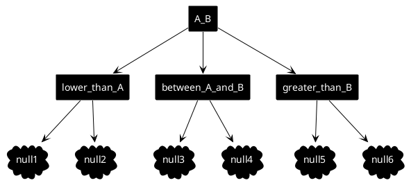

А теперь посмотрите на то, что получилось. Смело можно заявить, что это отсортированное, сбалансированное два-три дерево. Значения меньше лежат слева, значения больше - справа (тут, как и в случае со значениями 4-5-12, мы считаем, что 5 лежит справа от 4 и слева от 12). Корень имеет два значения и три потомка, что абсолютно соответствует описанию дерева выше. Сейчас вы можете сами попробовать добавить любое значение, чтобы удостовериться, что вы поняли логику (что произойдет с деревом, если добавить значение 7? А затем 9?).

Окей, с самим деревом, я надеюсь, разобрались. Ноды добавляются, дерево балансируется, искать можно, все супер. Но есть нюансы.

Главный минус такой структуры в том, что она, в отличие от бинарного дерева, неудобна в реализации. Нужно следить за количеством потомков и значением, плюс за их порядком, балансировкой (и это я еще не говорил про удаление). Красно-черное дерево решает эту проблему.

## Красно-черное дерево
Как мы выяснили, главный недостаток два-три дерева - его структура. Тогда давайте попробуем превратить два-три дерево в дерево бинарное. Как мы можем сделать это?


Чтобы добиться этого, нам нужно простое представление для 3-ноды. Давайте разделим 3-ноду на две 2-ноды и свяжем их ссылками. Пометим эти ссылки каким-нибудь свойством, например, цветом, (возьмём красный), чтобы отличать такие ссылки в дереве от всех остальных.

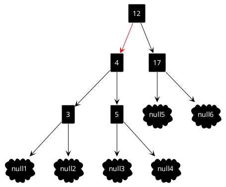

Вообще говоря, мы не можем пометить сами ссылки, поэтому мы помечаем ноды.

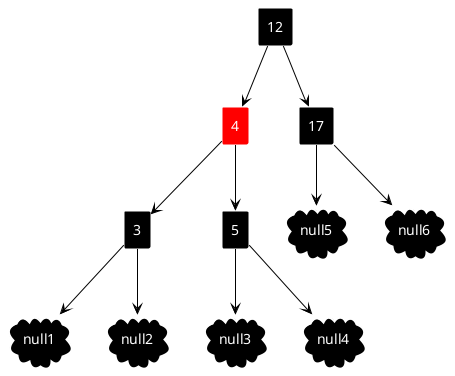

Итак, перед вами красно-черное дерево. Далее, мы разберем несколько свойств кчд, которые я считаю важными (но я думаю, что уже из прочитанного выше многое стало ясно).

## Свойства красно-черного дерева

_Спойлер_
Фактически мы разбираем не просто кчд, а левосторонне кчд - одна из имплементаций кчд, в которой красные ноды могут находится только слева, то есть от 3-ноды мы всегда отделям значение меньше (что и было сделано выше). По сути своей левостороннее кчд ничем не отличается от обычного, за исколючением того, что это более простая и понятная имплементация. Аналогично левостороннему кчд, существует и правостороннее кчд(логику его додумайте сами).

`Свойство 1.`

Две красные ноды не могут идти подряд. Это свойство приобретает смысл, если мы знаем, что красная нода - это по сути часть 3-ноды в 2-3 дереве. Ну а если две красные ноды идут подряд, то получается 4-нода, которой у нас не существует:)

`Свойство 2.`

Корень дерева всегда черный. Опять же, тут все понятно: красная нода не может существовать без родителя.

`Свойство 3.`

Все null-ноды (ноды, которые не имеют потомков) - черные. Почему именно так, для себя объяснений я не нашел. Но хочу сказать, что это довольно удобное правило, когда дело доходит до балансировки дерева.

_Про потомков_
Раз уж мы затронули null-ноды, то стоит сказать, что в дереве у всех нод всегда должно быть два потомка, а если ссылка на потомка нулевая, то ведет она как раз в null-ноду. На самом деле, тут встает вопрос в реализации, мне было удобнее добавлять null-ноду(меньше проблем с итераторами, балансировкой и прочим).

`Свойство 4.`

Высота дерева измеряется только по черным нодам и называется "черной высотой". Тут опять все в целом становится очевидным: красная нода является только дополнением к ноде черной, является ее частью, поэтому высоту принято считать по черным нодам.

На этом введение подходит к концу. В следующей части мы поговорим о том, как вставлять ноды в дерево и балансировать его.

# Понимаем красно-черное дерево. Часть 2. Балансировка и вставка

Это вторая часть из серии статей "Понимаем красно-черное дерево". Если вы пропустили первую часть, настоятельно рекомендую ознакомиться с ней здесь. Там мы разобрали причину появления кчд и расставили по полочкам некоторые его свойства.

В данной части мы разберем вставку и балансировку. Эти вещи идут бок о бок, без балансировки дерево будет терять свои свойства, и толка от него будет мало.

Держа в голове, что кчд - это 2-3 дерево (иногда я буду напоминать об этом), мы сразу начнем с его построения. Но некоторые уточнения все же нужны сейчас.

1. Все вставленные ноды, кроме корня дерева, вставляются с красным цветом. Объясняется это тем, что мы всегда сначала добавляем значение к уже существующей ноде и только после этого занимаемся балансировкой (вспомните ситуацию с получавшимися 4-нодами).

2. В первой части мы выяснили, что разбираем `левостороннее красно-черное дерево`, из этого следует, что красные ноды могут лежать только слева (обратный случай требует балансировки).

Также давайте разберемся с тремя операциями, которые понадобятся нам при балансировке. Я прошу не задумываться о них сейчас и вникнуть подробнее уже во время построения дерева. Я приведу их описание здесь, чтобы они не мешались потом:)

Первые две операции - это операции поворота. Эти операции также известны как малый левый и правый поворот, например, для АВЛ-дерева. Логика та же, но дополняется все это работой с цветами нод. Третья операция специализирована для кчд деревьев - это переворот цвета или свап цвета.

Если повороты будут для вас не понятны из этой статьи, то информации о них полно в интернете. Я же хочу показать, как ими пользоваться.

## Левосторонний поворот (левый малый поворот)
Здесь мы будем поворачивать наш узел влево. Картинка иллюстрирует поворот операцию.

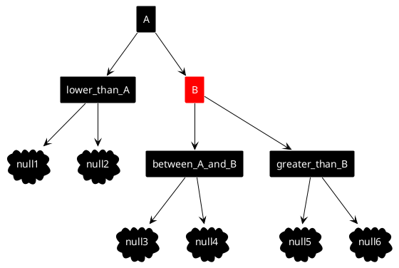
Левый поворот!

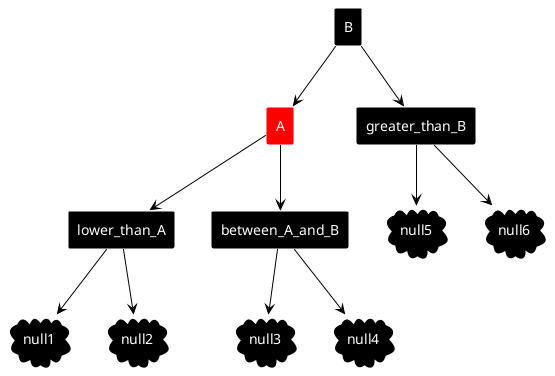
В первую очередь мы видим, что parentNode (здесь parentNode - это x, childNode - y) не только меняется местом с childNode, но и цветом. Но! Важно уточнить, что, если childNode принимает цвет своего родителя, то цвет parentNode всегда определяется как красный, независимо от предыдущего цвета потомка (левосторонний поворот просходит только тогда, когда цвет childNode - красный, поэтому нам легче сказать, что parentColor = RED, нежели свапать значения). Также обратите внимание на "переезд" левых потомков childNode (да, вам понадобится tempNode). Тут все так же логично, и это не нарушает баланс. Те потомки, что меньше childNode, больше parentNode, и childNode, соответственно, имеют такое же отношение (меньше/больше) к parentNode, как parentNode к своему родителю.

## Правосторонний поворот(малый правый поворот)
Тот же поворот, но в другую сторону. Логика аналогична левостороннему.

Правый поворот!


## Свап цвета
Свап цвета применяется тогда, когда у `parentNode` два красных потомка. Потомки становятся черными, а `parentNode` - красным. Операция легкая, обсуждать тут нечего.

```plantuml
@startuml
agent A #red;line:white;line.bold;text:white
agent B #black;line:white;line.bold;text:white
agent C #red;line:white;line.bold;text:white

B --> A
B --> C

@enduml
```

```plantuml
@startuml
agent A #black;line:white;line.bold;text:white
agent B #red;line:white;line.bold;text:white
agent C #black;line:white;line.bold;text:white

B --> A
B --> C

@enduml
```

Важно сказать, что все три операции изменяют дерево только локально (свап цвета изменяет ноду на уровень выше, но мы считаем это локальным изменением), и вызываем мы их на уровне `parentNode`! Мы не теряем сбалансированность на других этажах (если она была). В этом вы можете убедиться самостоятельно.

## Построение красно-черного дерева.
Итак, начнем построение нашего дерева.

Сначала добавим корень со значением 24. Тут как всегда все просто. Вы помните, что все добавленные ноды имеют красный цвет, кроме корня дерева.

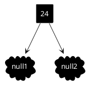

Следующая нода, которую мы вставим, имеет значение 5. По правилу бинарного дерева, нода опускается влево и по правилу кчд становится красной нодой.

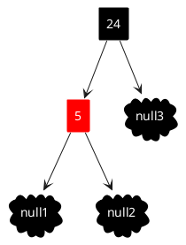

Нода со значением 1 становится потомком ноды 5. Здесь мы видим две идущие подряд красные ноды. В таком случае, нам нужно совершить нашу первую балансировку!

_спойлер_
Не секрет, что добавление ноды в дерево - процесс рекурсивный(даже если вы решаете его через циклы). То есть при добавлении ноды мы спускаемся в самый низ. Процесс балансировки же происходит при разварачивании рекурсии - когда мы поднимаемся наверх. Как я уже сказал выше, процесс балансировки - это локальная оперция. Нас не волнует положение дерева ниже\выще нашего уровня. Поэтому я прошу вас абстрагироваться от полной картинки и концентрироваться только на конкретном уровне, когда разбираете балансировку.

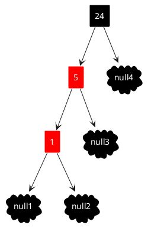

В конце этой части я приведу алгоритм и порядок проверок и выполнений операции балансировки для кчд. Но для того, чтобы вы поняли балансировку, а не просто запомнили, давайте попробуем покопаться сами.

Итак, в нашем арсенале 3 операции: правостороний поворот, левостороений поворот, свап цветов.

На ноде 1 у нас все в порядке, балансировать нечего. Поднимаемся выше. На ноде 5 так же - одна левостороння красная нода, все корректно (при балансировке мы не смотрим на цвет текущей ноды). На ноде 24 мы уже полностью видим наши подряд идущие красные ноды, значит, нам нужна балансировка.

Давайте пока просто попробуем подставить наши операции. Свап цвета нам не подходит - для свапа нужно два потомка с красным цветом. Левостороний поворот не имеет смысла, так как красных нод справа нет. Остается один вариант - правосторонний поворот в ноде 24. Итог вы видите на картинке.

```plantuml
@startuml
agent 24 #black;line:white;line.bold;text:white
agent 5 #red;line:white;line.bold;text:white
agent 1 #red;line:white;line.bold;text:white
cloud null1 #black;line:white;line.bold;text:white
cloud null2 #black;line:white;line.bold;text:white
cloud null3 #black;line:white;line.bold;text:white
cloud null4 #black;line:white;line.bold;text:white

24 --> 5
5 --> 1
1 --> null1
1 --> null2
5 --> null3
24 --> null4

@enduml
```


```plantuml
@startuml
agent 5 #black;line:white;line.bold;text:white
agent 1 #red;line:white;line.bold;text:white
agent 24 #red;line:white;line.bold;text:white
cloud null1 #black;line:white;line.bold;text:white
cloud null2 #black;line:white;line.bold;text:white
cloud null3 #black;line:white;line.bold;text:white
cloud null4 #black;line:white;line.bold;text:white

5 --> 1
5 --> 24
1 --> null1
1 --> null2
24 --> null3
24 --> null4

@enduml
```

Теперь мы видим, что у корня два красных потомка. Вот здесь то нам и понадобится операция свапа цвета! Результат ниже. (По правилам свапа нода 24 должна была стать красной, но так как это корень, цвет снова стал черным)

```plantuml
@startuml
agent 5 #black;line:white;line.bold;text:white
agent 1 #red;line:white;line.bold;text:white
agent 24 #red;line:white;line.bold;text:white
cloud null1 #black;line:white;line.bold;text:white
cloud null2 #black;line:white;line.bold;text:white
cloud null3 #black;line:white;line.bold;text:white
cloud null4 #black;line:white;line.bold;text:white

5 --> 1
5 --> 24
1 --> null1
1 --> null2
24 --> null3
24 --> null4

@enduml
```


```plantuml
@startuml
agent 5 #black;line:white;line.bold;text:white
agent 1 #black;line:white;line.bold;text:white
agent 24 #black;line:white;line.bold;text:white
cloud null1 #black;line:white;line.bold;text:white
cloud null2 #black;line:white;line.bold;text:white
cloud null3 #black;line:white;line.bold;text:white
cloud null4 #black;line:white;line.bold;text:white

5 --> 1
5 --> 24
1 --> null1
1 --> null2
24 --> null3
24 --> null4

@enduml
```

В итоге у нас снова корректное левостороннее кчд (и даже без красных нод)! А вот как это выглядело бы в 2-3 дереве.

На картинке видно, что в 2-3 дереве нам нужно меньше операций ("просачивание" ноды против поворота + свапа), но это не значит, что на практике сортировать его проще:) Операции вращения, кстати, не имеют аналогов с операциями 2-3 дерева, а операция свапа цвета - это, по сути, наше "просачивание" значения наверх.

```plantuml
@startuml
agent 1_5_24 #black;line:white;line.bold;text:white

cloud null1 #black;line:white;line.bold;text:white
cloud null2 #black;line:white;line.bold;text:white
cloud null3 #black;line:white;line.bold;text:white
cloud null4 #black;line:white;line.bold;text:white

1_5_24 --> null1
1_5_24 --> null2
1_5_24 --> null3
1_5_24 --> null4

@enduml
```

```plantuml
@startuml
agent 5 #black;line:white;line.bold;text:white
agent 1 #black;line:white;line.bold;text:white
agent 24 #black;line:white;line.bold;text:white
cloud null1 #black;line:white;line.bold;text:white
cloud null2 #black;line:white;line.bold;text:white
cloud null3 #black;line:white;line.bold;text:white
cloud null4 #black;line:white;line.bold;text:white

5 --> 1
5 --> 24
1 --> null1
1 --> null2
24 --> null3
24 --> null4

@enduml
```

Двигаемся дальше. Вставляем значение 15. Нода уходит в левого потомка ноды 24. Здесь балансировка не нужна.

```plantuml
@startuml
agent 5 #black;line:white;line.bold;text:white
agent 1 #black;line:white;line.bold;text:white
agent 24 #black;line:white;line.bold;text:white
agent 15 #red;line:white;line.bold;text:white
cloud null1 #black;line:white;line.bold;text:white
cloud null2 #black;line:white;line.bold;text:white
cloud null3 #black;line:white;line.bold;text:white
cloud null4 #black;line:white;line.bold;text:white
cloud null5 #black;line:white;line.bold;text:white

5 --> 1
5 --> 24
1 --> null1
1 --> null2
24 --> 15
15 --> null3
15 --> null4
24 --> null5

@enduml
```

Вставляем 3. Нода будет меньше корня, но уже больше 1, поэтому нода становится правым потомком ноды-1.

```plantuml
@startuml
agent 5 #black;line:white;line.bold;text:white
agent 1 #black;line:white;line.bold;text:white
cloud null1 #black;line:white;line.bold;text:white
agent 3 #red;line:white;line.bold;text:white
agent 24 #black;line:white;line.bold;text:white
agent 15 #red;line:white;line.bold;text:white
cloud null2 #black;line:white;line.bold;text:white
cloud null3 #black;line:white;line.bold;text:white
cloud null4 #black;line:white;line.bold;text:white
cloud null5 #black;line:white;line.bold;text:white
cloud null6 #black;line:white;line.bold;text:white

5 --> 1
5 --> 24
1 --> null1
1 --> 3
3 --> null2
3 --> null3
24 --> 15
15 --> null4
15 --> null5
24 --> null6

@enduml
```

Как мы видим, красная нода находится справа. И снова балансировка. В прошлый раз нас спасла комбинация правосторонний поворот + свап цвета. В этот раз поворот в право нас не спасет (как и свап цвета, я думаю, это очевидно). Сделаем поворот влево и посмотрим, что получится.

```plantuml
@startuml
agent 5 #black;line:white;line.bold;text:white
agent 1 #red;line:white;line.bold;text:white
agent 3 #black;line:white;line.bold;text:white
agent 24 #black;line:white;line.bold;text:white
agent 15 #red;line:white;line.bold;text:white
cloud null1 #black;line:white;line.bold;text:white
cloud null2 #black;line:white;line.bold;text:white
cloud null3 #black;line:white;line.bold;text:white
cloud null4 #black;line:white;line.bold;text:white
cloud null5 #black;line:white;line.bold;text:white
cloud null6 #black;line:white;line.bold;text:white

5 --> 3
5 --> 24
3 --> 1
1 --> null1
1 --> null2
3 --> null3
24 --> 15
15 --> null4
15 --> null5
24 --> null6

@enduml
```

Вуаля! Наше дерево снова корректно.

Я думаю, что уже сейчас вырисовываются какие-то правила и закономерности действий, но давайте не будем торопиться и рассмотрим еще пару примеров.

Последнее наше значение - 8. Куда оно встанет, догадайтесь сами. Результат мы видим на картинке. Такая ситуация нам уже встречалась, и мы знаем, что делать.


```plantuml
@startuml
agent 5 #black;line:white;line.bold;text:white
agent 1 #red;line:white;line.bold;text:white
agent 3 #black;line:white;line.bold;text:white
agent 24 #black;line:white;line.bold;text:white
agent 15 #red;line:white;line.bold;text:white
agent 8 #red;line:white;line.bold;text:white
cloud null1 #black;line:white;line.bold;text:white
cloud null2 #black;line:white;line.bold;text:white
cloud null3 #black;line:white;line.bold;text:white
cloud null4 #black;line:white;line.bold;text:white
cloud null5 #black;line:white;line.bold;text:white
cloud null6 #black;line:white;line.bold;text:white
cloud null7 #black;line:white;line.bold;text:white

5 --> 3
5 --> 24
3 --> 1
1 --> null1
1 --> null2
3 --> null3
24 --> 15
15 --> 8
8 --> null4
8 --> null5
15 --> null6
24 --> null7

@enduml
```

Правосторонний поворот + свап цвета дает нам следующий результат.


```plantuml
@startuml
agent 5 #black;line:white;line.bold;text:white
agent 1 #red;line:white;line.bold;text:white
agent 3 #black;line:white;line.bold;text:white
agent 15 #red;line:white;line.bold;text:white
agent 8 #black;line:white;line.bold;text:white
agent 24 #black;line:white;line.bold;text:white
cloud null1 #black;line:white;line.bold;text:white
cloud null2 #black;line:white;line.bold;text:white
cloud null3 #black;line:white;line.bold;text:white
cloud null4 #black;line:white;line.bold;text:white
cloud null5 #black;line:white;line.bold;text:white
cloud null6 #black;line:white;line.bold;text:white
cloud null7 #black;line:white;line.bold;text:white

5 --> 3
5 --> 15
3 --> 1
1 --> null1
1 --> null2
3 --> null3
15 --> 8
15 --> 24
8 --> null4
8 --> null5
24 --> null6
24 --> null7

@enduml
```

Видим, что на нашем уровне(нода 15) ситуация стала лучше - сама нода красная, оба потомка черного цвета. Условия валидны. Поднимаясь на уровень выше, мы снова видим проблему - красная нода справа. Как это решить мы также знаем. Левосторонний поворот!


```plantuml
@startuml
agent 15 #black;line:white;line.bold;text:white
agent 5 #red;line:white;line.bold;text:white
agent 24 #black;line:white;line.bold;text:white
agent 3 #black;line:white;line.bold;text:white
agent 8 #black;line:white;line.bold;text:white
agent 1 #red;line:white;line.bold;text:white
cloud null1 #black;line:white;line.bold;text:white
cloud null2 #black;line:white;line.bold;text:white
cloud null3 #black;line:white;line.bold;text:white
cloud null4 #black;line:white;line.bold;text:white
cloud null5 #black;line:white;line.bold;text:white
cloud null6 #black;line:white;line.bold;text:white
cloud null7 #black;line:white;line.bold;text:white

15 --> 5
15 --> 24
5 --> 3
5 --> 8
3 --> 1

1 --> null1
1 --> null2
3 --> null3
8 --> null4
8 --> null5
24 --> null6
24 --> null7

@enduml
```

Ожидаемый итог - снова корректное левостороннее красно-черное дерево.

Вам может показаться, что дерево перестроилось кардинальным образом. Но если приглядеться, то станет понятно, что это не так. Последний левосторонний поворот поменял наше дерево лишь на одном уровне. Все остальные ноды остались на месте.

Вот в целом и все. За исключением пары моментов, построение дерева будет выглядеть примерно так. Как и в случае 2-3 дерева попробуйте сейчас сами добавить пару значений в дерево (ноды 13 и 16, например, интересный случай).

Как я уже говорил выше - операция балансировки это дело локальное, поэтому мы не думаем и не должны думать о том, что происходит на этаж выше\ниже. Это очень удобно при написании кода.

Ниже в спойлере я приведу алгоритм, на который можно опираться при написании кода, а вы можете попробовать привести решение сами.

### Алгоритм балансировки кчд
1. если правая нода красная и левая нода черная - левосторонний поворот

2. если левая нода красная и левая нода левой ноды красная - правосторонний поворот

3. если левая нода красная и правосторонняя нода красная - делаем свап цвета.

Все использования операций логичны - вращаем ноду влево, если красная нода справа. Вращаем ноду вправо, если две красные ноды идут подряд, чтобы потом сделать свап цвета. Не старайтесь запомнить это, постарайтесь понять!

Теперь вы можете пробежаться по построению дерева еще раз и проанализировать, свериться со свойствами из первой статьи, задаться вопросами "а что будет если...?" (поверьте, это очень полезно!). В целом, это все, что я хотел рассказать вам про вставку ноды в левостороннее красно-черное дерево.

## Немного об операции поиска значения
Операция получения ничем не будет отличаться от поиска в любом другом бинарном дереве - цвет тут никак не участвует.

